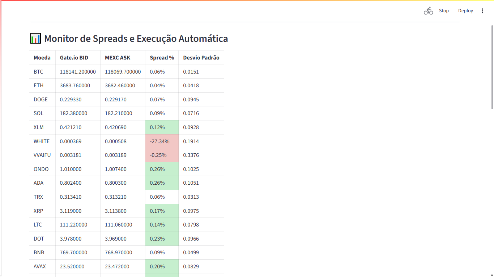
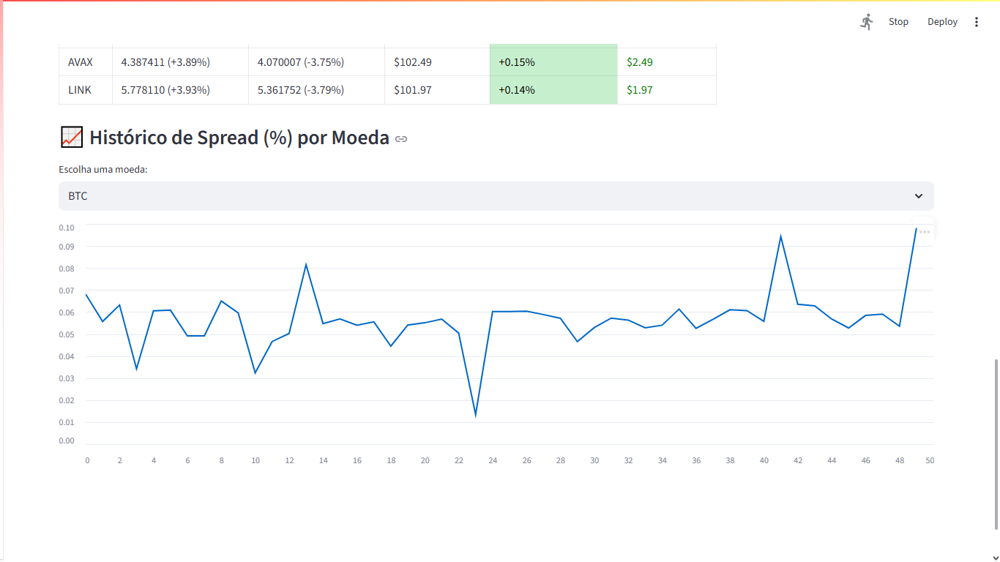
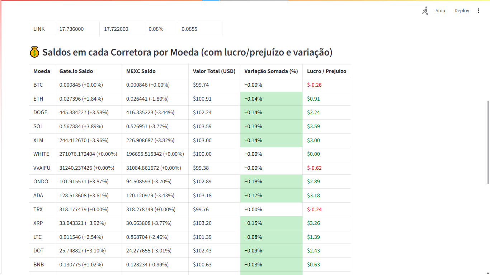

# Arbitragem Criptomoedas
## Tecnologias:
- Python
- Streamlit
- Redis
- Docker

### Demonstração:

__ Spreads por moeda: __

__ Rendimento na simulação: __

## Como rodar:

Clone o repositório
> git clone https://github.com/RyanFBertaglia/MoedasEmCorretoras.git

Crie o container do redis
> docker run -d --name redis-arbitragem -p 6379:6379 redis/redis-stack-server

Importe as dependencias
> Abra o arquivo requirements.txt e rode os comandos

Inicialize os dados de referencia
> python init_database.py

Rode a aplicação
> streamlit run main.py

Após isso abra no navegador a página
> http://localhost:8501